# Report

## Part 1

The challenge was to automatically detect carpet regions in raw vibration signals and propose a metric to quantify carpet severity. The carpet detector consists of 5 steps:

1. **PSD estimation:** The power spectral density is estimated from the time-domain signal using Welch's method with a Hanning window. The segment length is controlled by `ratio_delta_f` (a multiplier on the native frequency resolution), and segments are overlapped by a fraction `overlap`.

2. **Median smoothing:** The PSD is smoothed above `min_start_freq_hz` (1000 Hz, by default) using a median filter with a sliding window of fixed bandwidth `median_window_hz`.

3. **dB normalization:** The smoothed PSD is converted to decibels relative to its maximum value above `min_start_freq_hz`.

4. **Band detection:** Contiguous frequency regions where the normalized PSD exceeds `psd_threshold_db` are extracted, subject to the minimum starting frequency `min_start_freq_hz` and a minimum carpet bandwidth `min_bandwidth_hz`.

5. **Band merging:** Adjacent carpets whose gap is smaller than `max_band_gap_hz` are merged into a single carpet region. This is done to prevent narrow dips of the normalized PSD below the detection threshold from splitting an otherwise continuous carpet, simplifying the visual interpretation of results.

The carpet detector parameters and their default values are listed below. These parameters are stored in a JSON configuration file, allowing them to be tuned independently for a given machine or measurement setup (for instance, `psd_threshold_db` may need adjustment depending on the signal-to-noise ratio).

| Parameter | Default | Description |
|---|---|---|
| `median_window_hz` | 100 Hz | Median filter bandwidth |
| `psd_threshold_db` | −80 dB | Detection threshold relative to PSD max (must be < 0) |
| `min_bandwidth_hz` | 100 Hz | Minimum width for a valid carpet band |
| `min_start_freq_hz` | 1000 Hz | Frequency below which bands are ignored |
| `max_band_gap_hz` | 150 Hz | Maximum gap between bands before merging |
| `ratio_delta_f` | 1.1 | Welch segment length multiplier (must be > 1) |
| `overlap` | 0.9 | Welch segment overlap fraction ∈ [0, 1) |
| `window_name` | `"hanning"` | FFT window type |

For displaying the results, the one-sided amplitude spectrum is computed separately via FFT, scaled to account for amplitude loss due to windowing, and plotted in linear scale. The detected carpets are overlaid as shaded frequency bands.

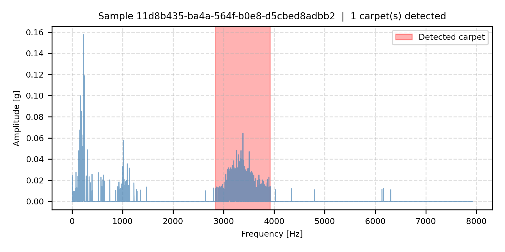

*Figure 1 — Sample 11d8b435-ba4a-564f-b0e8-d5cbed8adbb2.*

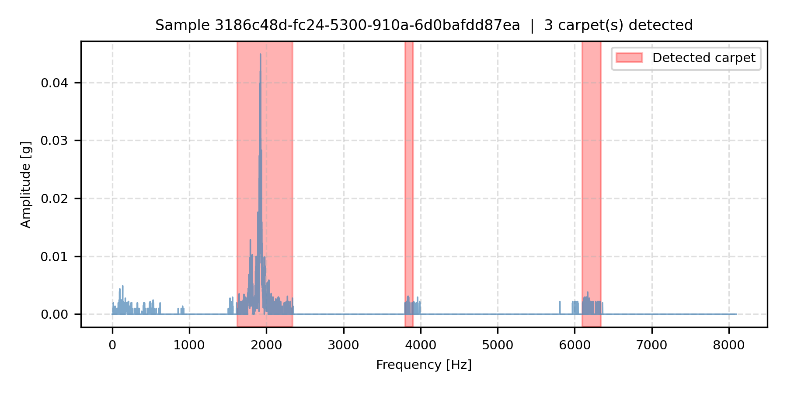

*Figure 2 — Sample 3186c48d-fc24-5300-910a-6d0bafdd87ea.*

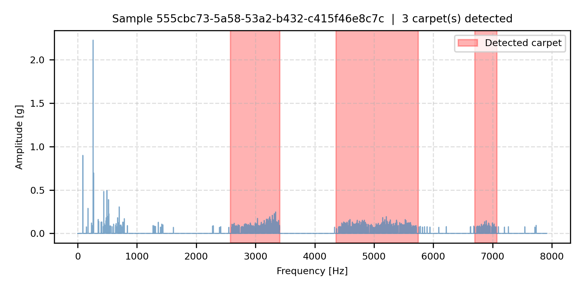

*Figure 3 — Sample 555cbc73-5a58-53a2-b432-c415f46e8c7c.*

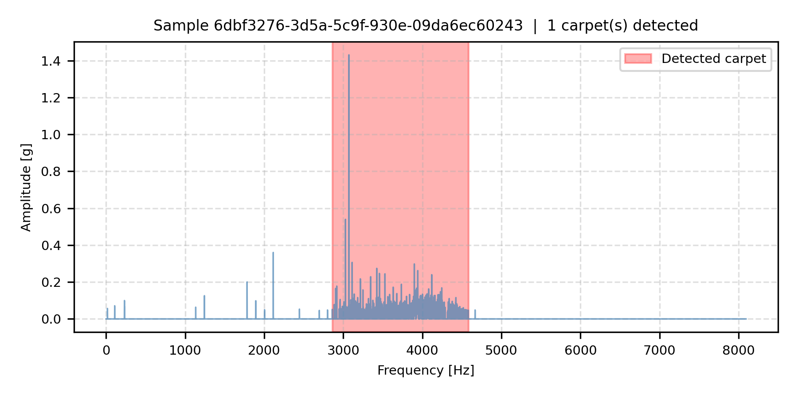

*Figure 4 — Sample 6dbf3276-3d5a-5c9f-930e-09da6ec60243.*

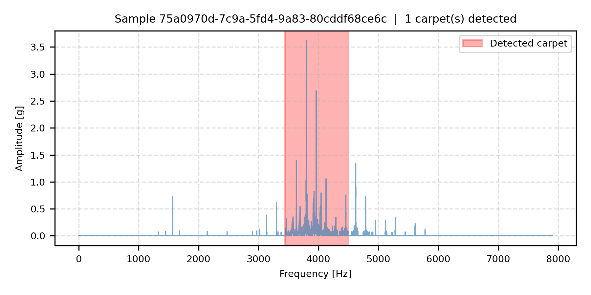

*Figure 5 — Sample 75a0970d-7c9a-5fd4-9a83-80cddf68ce6c.*

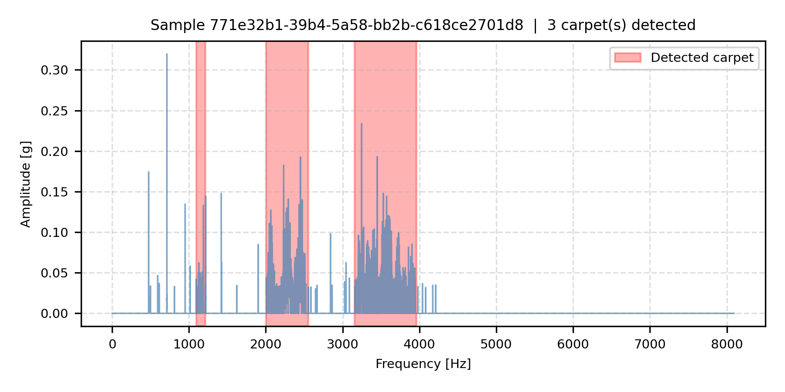

*Figure 6 — Sample 771e32b1-39b4-5a58-bb2b-c618ce2701d8.*

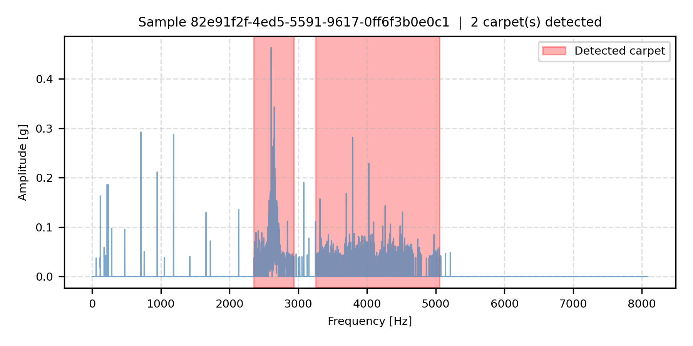

*Figure 7 — Sample 82e91f2f-4ed5-5591-9617-0ff6f3b0e0c1.*

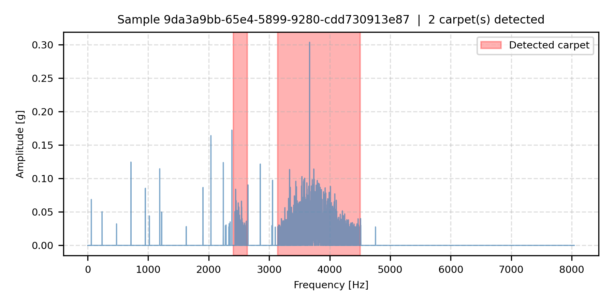

*Figure 8 — Sample 9da3a9bb-65e4-5899-9280-cdd730913e87.*

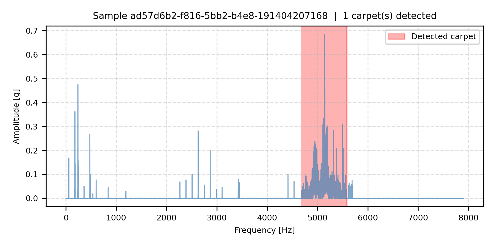

*Figure 9 — Sample ad57d6b2-f816-5bb2-b4e8-191404207168.*

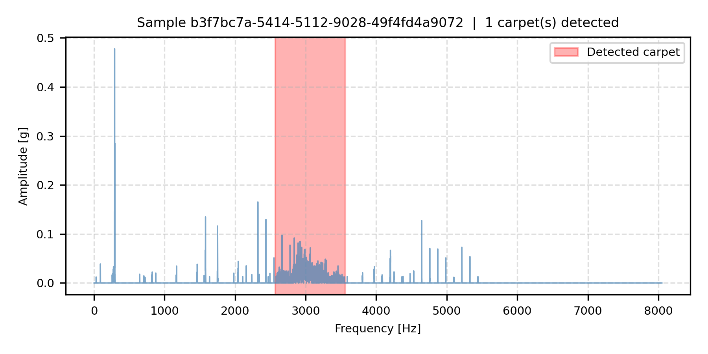

*Figure 10 — Sample b3f7bc7a-5414-5112-9028-49f4fd4a9072.*

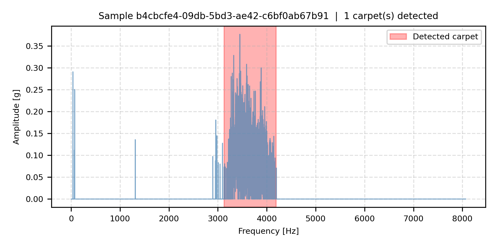

*Figure 11 — Sample b4cbcfe4-09db-5bd3-ae42-c6bf0ab67b91.*

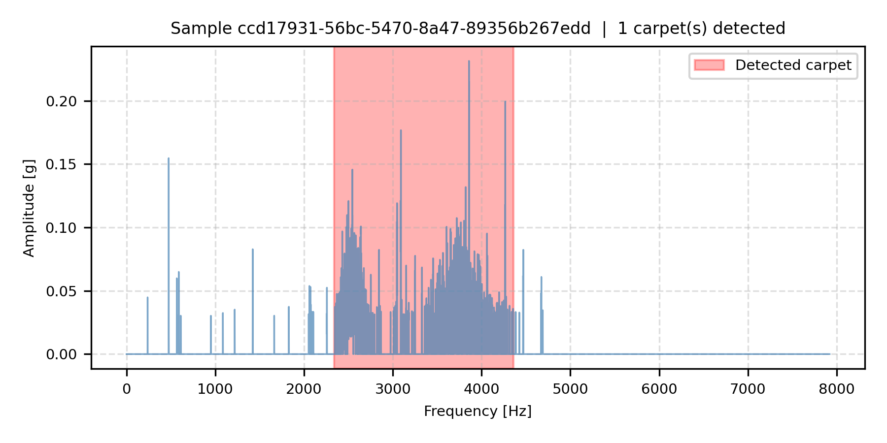

*Figure 12 — Sample ccd17931-56bc-5470-8a47-89356b267edd.*

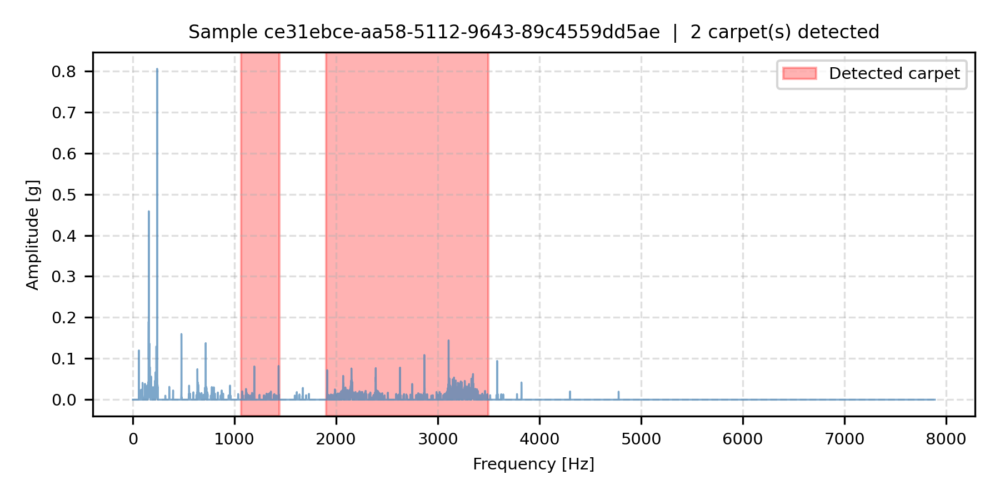

*Figure 13 — Sample ce31ebce-aa58-5112-9643-89c4559dd5ae.*

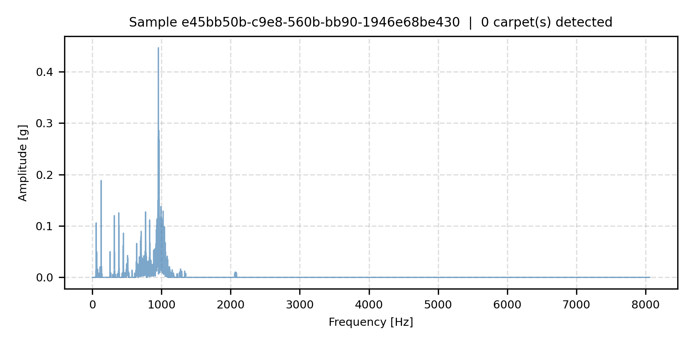

*Figure 14 — Sample e45bb50b-c9e8-560b-bb90-1946e68be430.*

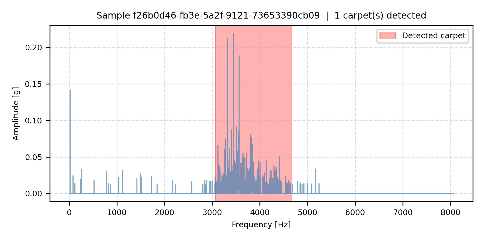

*Figure 15 — Sample f26b0d46-fb3e-5a2f-9121-73653390cb09.*

To quantify carpet severity, the carpet power ratio (CPR) is proposed as a metric. It is defined as the ratio of the PSD $S(f)$ integrated over all $N$ detected carpet bands to the total power above `min_start_freq_hz`:

$$\text{CPR} = \frac{\displaystyle\sum_{k=1}^N \int_{f_{\text{lower},k}}^{f_{\text{upper},k}} S(f)\ \text{d}f}{\displaystyle\int_{f_{\min}}^{f_{\text{Nyquist}}} S(f)\ \text{d}f}$$

A higher CPR indicates a greater proportion of high-frequency energy concentrated in carpet bands. The table below ranks the samples in order of descending CPR.

| Rank | Sample | CPR |
|------|--------|-----|
| 1 | 3186c48d-fc24-5300-910a-6d0bafdd87ea | 0.994929 |
| 2 | b4cbcfe4-09db-5bd3-ae42-c6bf0ab67b91 | 0.988752 |
| 3 | f26b0d46-fb3e-5a2f-9121-73653390cb09 | 0.980305 |
| 4 | 6dbf3276-3d5a-5c9f-930e-09da6ec60243 | 0.974388 |
| 5 | ccd17931-56bc-5470-8a47-89356b267edd | 0.974337 |
| 6 | 555cbc73-5a58-53a2-b432-c415f46e8c7c | 0.963454 |
| 7 | 771e32b1-39b4-5a58-bb2b-c618ce2701d8 | 0.962456 |
| 8 | ad57d6b2-f816-5bb2-b4e8-191404207168 | 0.962315 |
| 9 | ce31ebce-aa58-5112-9643-89c4559dd5ae | 0.949124 |
| 10 | 82e91f2f-4ed5-5591-9617-0ff6f3b0e0c1 | 0.942779 |
| 11 | 11d8b435-ba4a-564f-b0e8-d5cbed8adbb2 | 0.917553 |
| 12 | 9da3a9bb-65e4-5899-9280-cdd730913e87 | 0.916166 |
| 13 | 75a0970d-7c9a-5fd4-9a83-80cddf68ce6c | 0.900746 |
| 14 | b3f7bc7a-5414-5112-9028-49f4fd4a9072 | 0.697432 |
| 15 | e45bb50b-c9e8-560b-bb90-1946e68be430 | 0.000000 |

## Part 2

The challenge was to develop a model to distinguish between healthy and loose assets from tri-axial vibration signals, and to predict the condition of unlabeled test samples. A supervised machine learning approach was selected for this task.

### Feature Extraction

Spectral features are extracted per orientation (horizontal, vertical, axial) from the one-sided amplitude spectrum, computed via FFT with Hanning windowing. Rather than targeting the amplitude of individual harmonics, the features are engineered to characterize the collective behavior of harmonics 3× to 10× the rotational frequency as a group. This intends to make the model less sensitive to faults whose symptoms manifest at a more selective set of individual harmonics (e.g., 1× in unbalanced rotors or integer multiples of the blade passage frequency in turbomachinery). The features are:

| Feature | Description |
|---|---|
| `harmonic_flatness` | Geometric-to-arithmetic mean ratio of harmonic amplitudes. |
| `harmonic_irregularity` | Normalized sum of squared differences between consecutive harmonic amplitudes. |
| `harmonic_coeff_variation` | Coefficient of variation of harmonic amplitudes. |

where $A_k$ is the peak amplitude at the $k$-th harmonic:

$$\text{harmonic\\ flatness} = \dfrac{\left(\prod_{k} A_k\right)^{1/K}}{\frac{1}{K}\sum_{k} A_k}$$

$$\text{harmonic\\ irregularity} = \dfrac{\sum_{k}(A_k - A_{k+1})^2}{\sum_{k} A_k^2}$$

$$\text{harmonic\\ coeff\\ variation} = \dfrac{\text{std}(A)}{\text{mean}(A)}$$

Amplitude at harmonics 3× to 10× the rotational frequency are extracted as the maximum value within a narrow band of ±10% of the rotational frequency centered at each harmonic. The feature distributions are shown in the violin plots below. Among the extracted features, `hor_harmonic_coeff_variation` and `hor_harmonic_flatness` are particularly discriminative between healthy and loose assets.

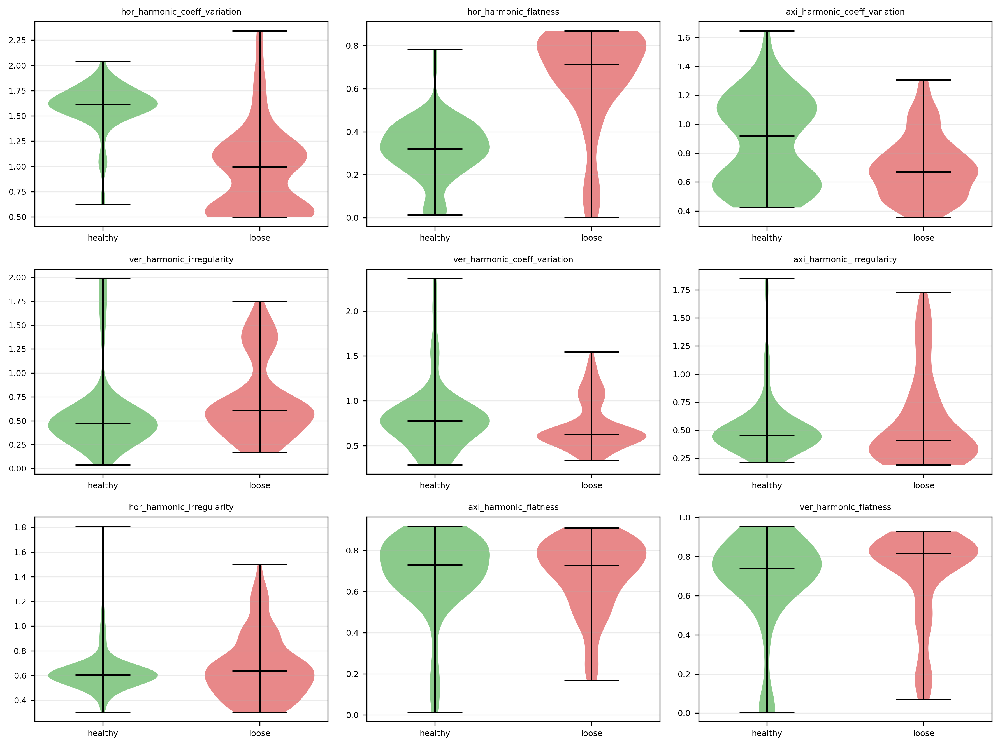

*Figure 16 — Violin plots of the feature distributions across the healthy and loose classes.*

The inter-feature Spearman correlations are shown below.

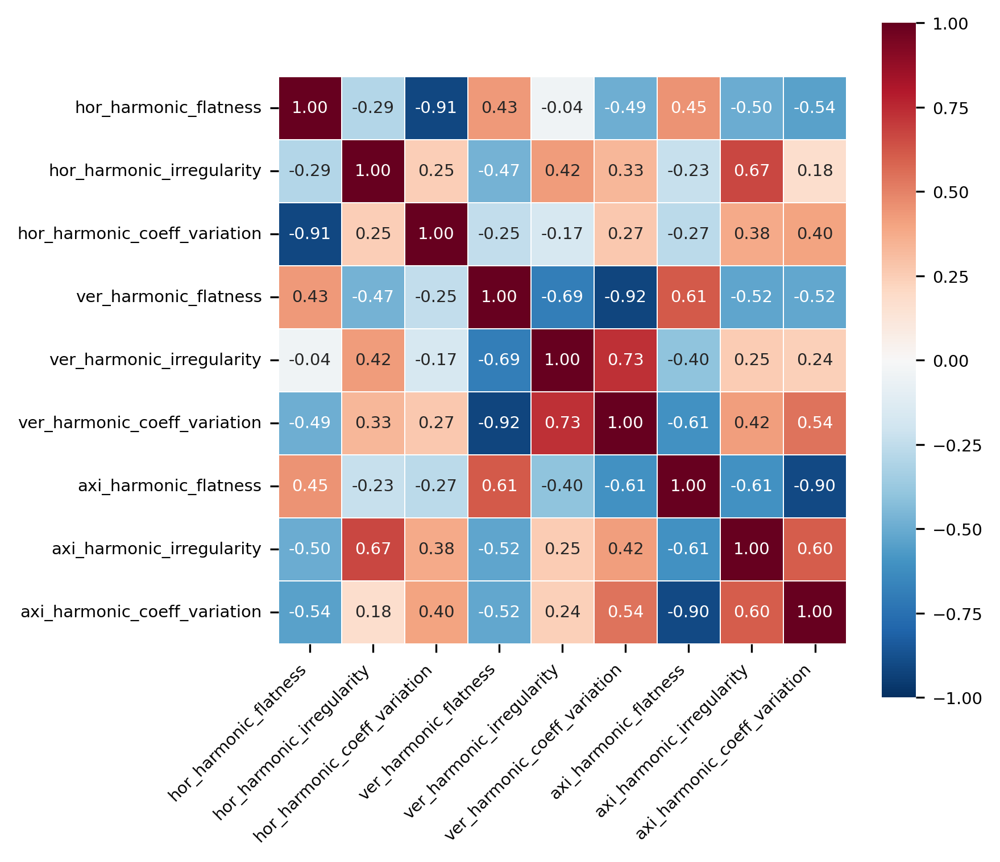

*Figure 17 — Feature-to-feature heatmap of Spearman correlation.*

### Binary Classifier

A Logistic Regression model with standard scaling (`StandardScaler + LogisticRegression`) is adopted for binary classification, motivated primarily by its interpretability and its ability to readily provide a score for quantifying the looseness symptom.

The hyperparameters (regularization strength `C` and penalty type `l1`/`l2`) are selected via `RandomizedSearchCV` with 100 draws over a log-uniform search space, using stratified 3-fold CV (`StratifiedKFold`) scored by AUROC. The classification threshold is tuned by maximizing the $F_\beta$ score with $\beta = 1$ on out-of-fold probability estimates from `cross_val_predict`. This metric can be adjusted via $\beta$ depending on whether false negatives or false positives are costlier for a given type of asset.

An unbiased generalization estimate is obtained via nested cross-validation with 5 outer stratified folds and 3 inner stratified folds. The outer loop yields performance estimates on held-out data never seen during hyperparameter optimization or threshold tuning. The inner loop runs `RandomizedSearchCV` independently per outer fold, and threshold tuning is performed on out-of-fold predictions of the outer training set via `cross_val_predict`, thereby preventing leakage from the outer validation fold.

The per-fold and average metrics are reported below. All folds achieve an AUROC above 0.89, indicating strong and consistent discriminative ability. A confusion matrix is obtained by summing the per-fold confusion matrices across all 5 outer folds, as shown below.

| Fold | AUROC | F1 | Precision | Recall |
|------|-------|----|-----------|--------|
| Fold 1 | 0.9786 | 0.9697 | 0.9697 | 0.9697 |
| Fold 2 | 0.9982 | 0.9714 | 0.9444 | 1.0000 |
| Fold 3 | 1.0000 | 0.9855 | 0.9714 | 1.0000 |
| Fold 4 | 0.9761 | 0.9231 | 0.9677 | 0.8824 |
| Fold 5 | 0.8915 | 0.9315 | 0.8718 | 1.0000 |
| **Mean ± Std** | 0.9689 ± 0.0399 | 0.9562 ± 0.0244 | 0.9450 ± 0.0379 | 0.9704 ± 0.0455 |

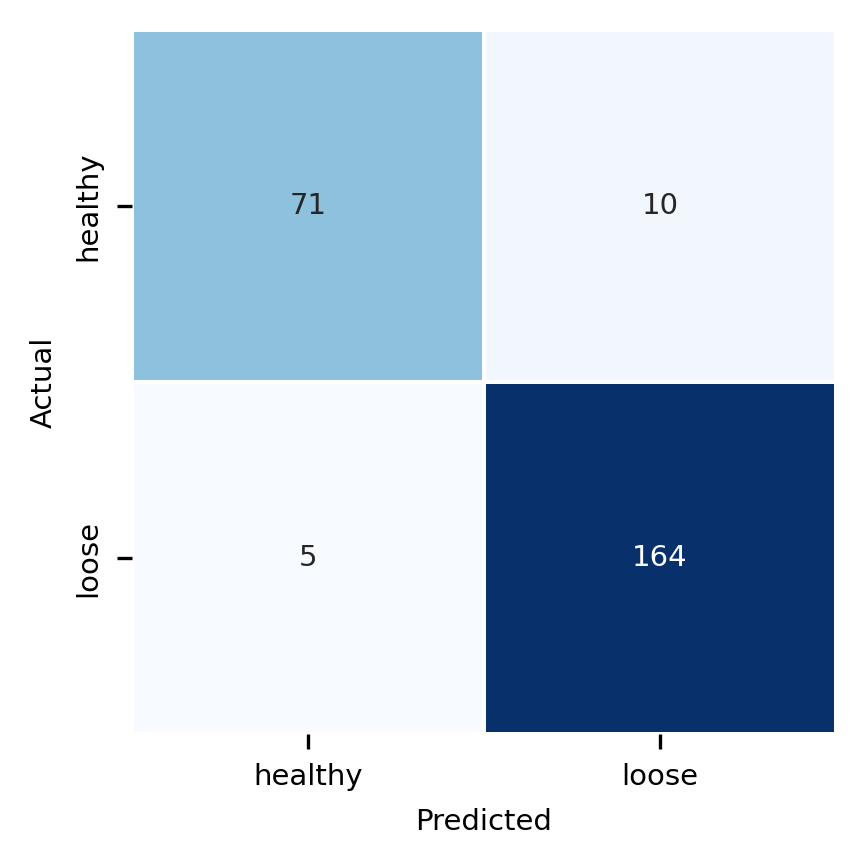

*Figure 18 — Summed confusion matrix across 5 outer folds of nested cross-validation.*

The final model is trained on the full labeled dataset using a fresh `RandomizedSearchCV` with stratified 3-fold inner CV, after which `refit=True` retrains on 100% of the data with the optimized hyperparameters. The threshold is then tuned on full-dataset out-of-fold predictions from `cross_val_predict`.

### Inference on Test Data

The trained model is applied to each test sample, assigning a label and a score between 0 and 1. The table below ranks the samples in order of descending score.

| Sample | Asset type | RPM | Score | Prediction |
|--------|------------|-----|-------|------------|
| e057600e-3b4e-58ba-b8b8-357169ae6bf6 | spindle | 1800 | 0.997541 | structural_looseness |
| 9f3b933a-1bc3-5093-9dee-800cc03c6b1d | bearing | 1590 | 0.987732 | structural_looseness |
| 680bbcbf-b1c8-544d-8f80-bf763cdcd128 | compressor | 3573 | 0.190437 | healthy |
| 01e98ad9-23c9-5986-ace0-4519bad71198 | bearing | 1785 | 0.150442 | healthy |
| 1dab1534-b8a8-5962-b01c-bff0782d54a9 | compressor | 3545 | 0.002282 | healthy |
| 2211750b-6672-5a94-bd40-cda811f69d01 | fan | 2025 | 0.000021 | healthy |
| 33542920-30ea-5844-861d-2c82d79087b8 | electric-motor | 1170 | 0.000000 | healthy |

The heatmap below summarises the per-feature contributions to the log-odds for each test sample, aiding model interpretability. Positive values (red) push the prediction toward looseness, negative values (blue) toward healthy.

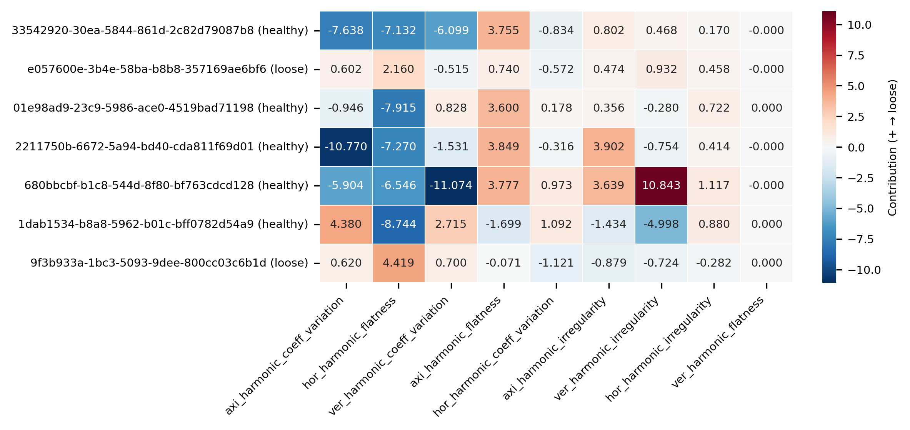

---

**Sample 33542920-30ea-5844-861d-2c82d79087b8 — Electric motor, 1170 RPM — Healthy (score: 0.000)**

The dominant driver is the negative contribution from `axial_harmonic_coeff_variation` (−7.64), indicating high dispersion of harmonic amplitudes in the axial direction.

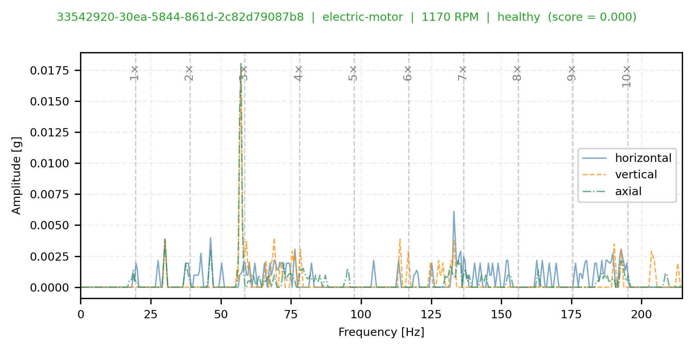

---

**Sample e057600e-3b4e-58ba-b8b8-357169ae6bf6 — Spindle, 1800 RPM — Structural looseness (score: 0.998)**

The dominant driver is the positive contribution from `horizontal_harmonic_flatness` (+2.16), indicating that harmonic amplitudes in the horizontal direction are broadly and evenly distributed.

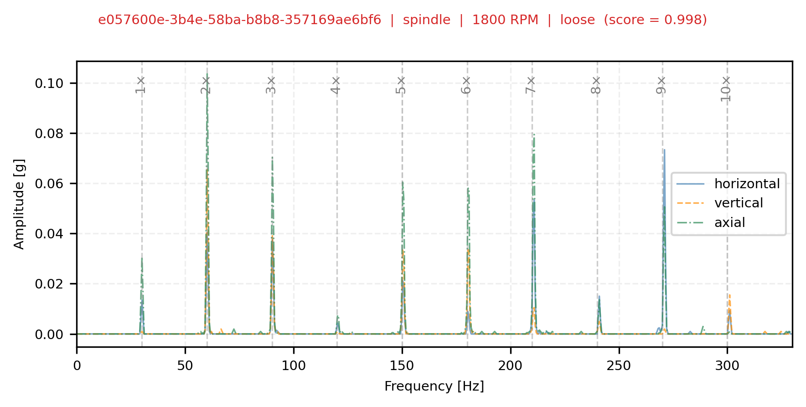

---

**Sample 01e98ad9-23c9-5986-ace0-4519bad71198 — Bearing, 1785 RPM — Healthy (score: 0.150)**

The dominant driver is the negative contribution from `horizontal_harmonic_flatness` (−7.92), indicating that horizontal harmonic energy is concentrated in few components.

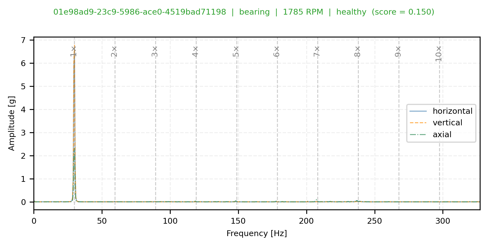

---

**Sample 2211750b-6672-5a94-bd40-cda811f69d01 — Fan, 2025 RPM — Healthy (score: 0.000)**

The dominant driver is the negative contribution from `axial_harmonic_coeff_variation` (−10.77), indicating high dispersion of harmonic amplitudes in the axial direction.

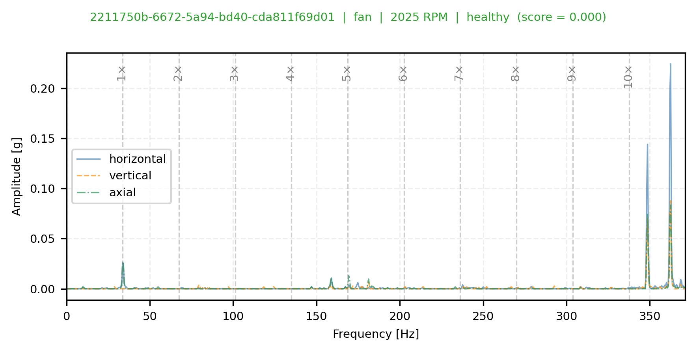

---

**Sample 680bbcbf-b1c8-544d-8f80-bf763cdcd128 — Compressor, 3573 RPM — Healthy (score: 0.190)**

The dominant driver is the negative contribution from `vertical_harmonic_coeff_variation` (−11.07), indicating high dispersion of harmonic amplitudes in the vertical direction.

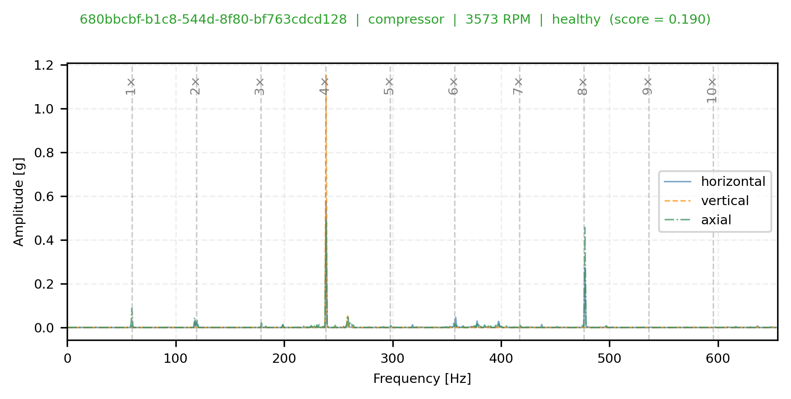

---

**Sample 1dab1534-b8a8-5962-b01c-bff0782d54a9 — Compressor, 3545 RPM — Healthy (score: 0.002)**

The dominant driver is the negative contribution from `horizontal_harmonic_flatness` (−8.74), indicating that horizontal harmonic energy is concentrated in few components.

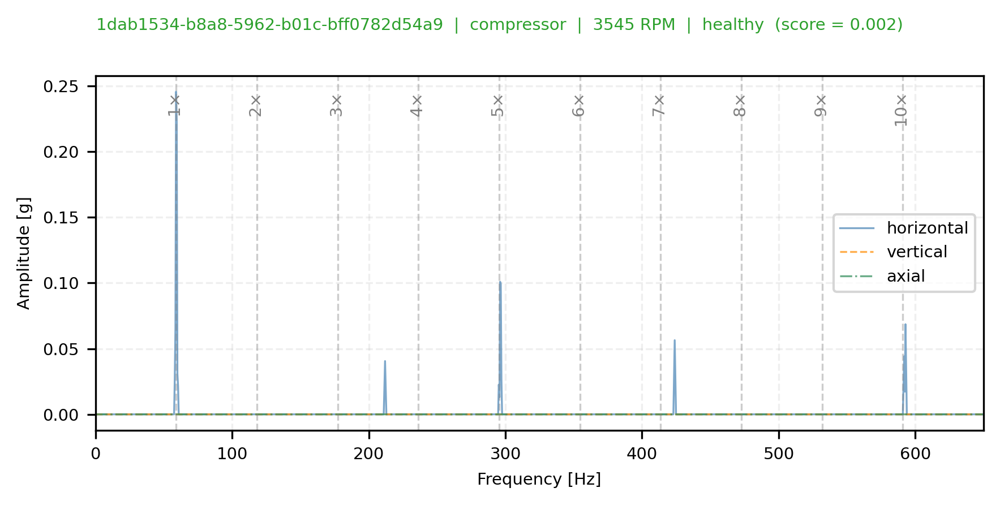

---

**Sample 9f3b933a-1bc3-5093-9dee-800cc03c6b1d — Bearing, 1590 RPM — Structural looseness (score: 0.988)**

The dominant driver is the positive contribution from `horizontal_harmonic_flatness` (+4.42), indicating that harmonic amplitudes in the horizontal direction are broadly and evenly distributed. 

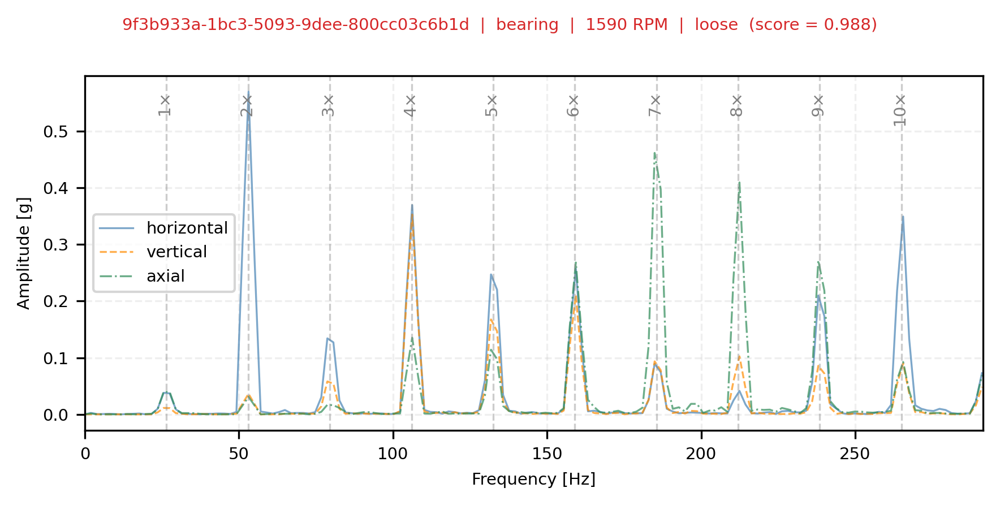
